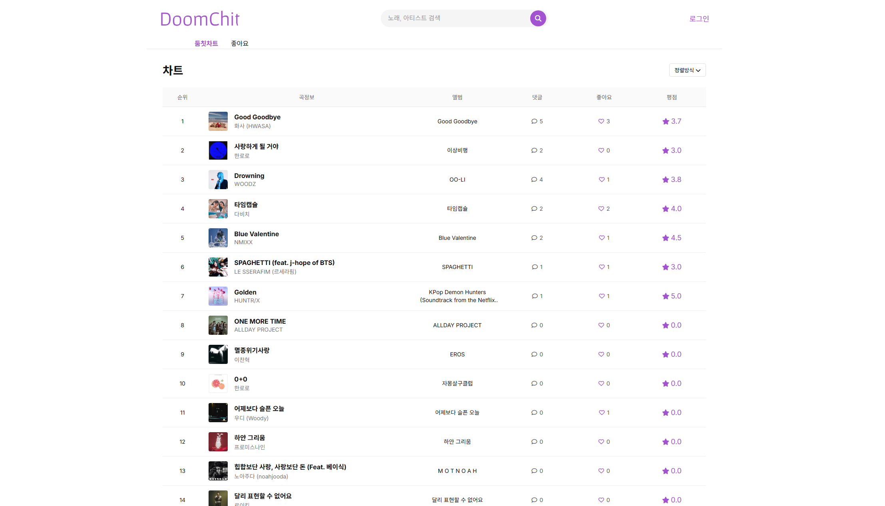

# DoomChit



DoomChit은 멜론 차트 데이터를 기반으로 곡 정보를 보여주고, 사용자 리뷰와 좋아요를 기록할 수 있는 Spring Boot 웹 프로젝트입니다. 메인 화면에서 최신 차트 목록을 확인하고, 검색 자동완성으로 곡을 찾은 뒤 상세 페이지에서 가사, 발매일, 작사/작곡 정보, 리뷰, 좋아요 수를 함께 볼 수 있습니다.

## 프로젝트 개요

- 멜론 모바일 차트 API를 호출해 차트 데이터를 가져옵니다.
- 곡 상세 페이지 진입 시 Jsoup로 멜론 웹 페이지를 스크래핑해 가사와 추가 메타데이터를 보강합니다.
- 회원가입과 로그인은 Spring Security 기반으로 처리합니다.
- 로그인 사용자는 리뷰 작성/수정/삭제와 좋아요 토글이 가능합니다.
- 사용자가 좋아요한 곡만 따로 모아보는 페이지를 제공합니다.

## 주요 기능

### 1. 차트 조회

- `/doomchit/main`에서 멜론 차트 곡 목록을 표시합니다.
- 곡별 순위, 앨범 이미지, 앨범명, 리뷰 수, 좋아요 수, 평균 평점을 함께 보여줍니다.
- 프런트에서 댓글 수, 좋아요 수, 평점 기준 정렬을 지원합니다.

### 2. 검색 자동완성

- 헤더 검색창에서 `/doomchit/search`를 호출해 멜론 검색 결과를 자동완성으로 보여줍니다.
- 검색 결과를 클릭하면 해당 멜론 `musicId`를 기준으로 상세 페이지로 이동합니다.

### 3. 곡 상세 정보

- `/doomchit/music/detail/{musicId}` 요청 시 내부 DB에서 곡을 찾거나 새로 저장합니다.
- 상세 페이지에서 아래 정보를 확인할 수 있습니다.
- 가사
- 장르
- 발매일
- 발매사 / 기획사
- 작사 / 작곡 정보
- 앨범 트랙리스트
- 평균 평점과 리뷰 개수
- 좋아요 수와 사용자 좋아요 상태

### 4. 리뷰

- `/doomchit/reviews/{mno}`에서 곡 상세와 리뷰를 함께 제공합니다.
- 로그인 사용자는 0.5점 단위 별점과 텍스트 리뷰를 작성할 수 있습니다.
- 작성자는 본인 리뷰만 수정/삭제할 수 있습니다.
- 최신순, 평점순 정렬이 가능합니다.

### 5. 좋아요

- 로그인 사용자는 곡 상세 페이지에서 좋아요를 토글할 수 있습니다.
- `/doomchit/likes`에서 내가 좋아요한 곡 목록을 확인할 수 있습니다.

### 6. 회원 기능

- 회원가입, 로그인, 로그아웃을 지원합니다.
- 비밀번호는 `BCryptPasswordEncoder`로 암호화해 저장합니다.
- 아이디와 닉네임 중복 검사를 수행합니다.

## 기술 스택

- Java 21
- Spring Boot 3.4.x
- Spring Web
- Spring Data JPA
- Spring Security
- Thymeleaf
- MySQL
- WebClient
- Jsoup
- Lombok
- Bootstrap / Font Awesome

## 데이터 모델

주요 엔티티는 아래 4개입니다.

- `Users`: 로그인 아이디, 암호화된 비밀번호, 닉네임
- `Music`: 멜론 곡 ID, 제목, 가수, 앨범, 가사, 장르, 발매 정보 등
- `Review`: 곡별 사용자 리뷰, 평점, 작성일/수정일
- `Likes`: 사용자-곡 좋아요 관계

## 실행 방법

### 1. 요구 사항

- JDK 21
- MySQL
- Gradle Wrapper 사용 가능 환경

### 2. 설정

`src/main/resources/application.properties`에 데이터베이스 연결 정보가 들어 있습니다.

기본 설정:

- 서버 포트: `8585`
- JPA DDL 옵션: `update`

실행 전에 실제 사용 가능한 MySQL 접속 정보로 수정하는 것을 권장합니다.

### 3. 실행

```bash
./gradlew bootRun
```

Windows:

```powershell
.\gradlew.bat bootRun
```

실행 후 접속:

```text
http://localhost:8585
```

## 디렉터리 구조

```text
src/main/java/com/mysite/doomchit
├─ MainController.java          메인/좋아요 목록/검색
├─ SecurityConfig.java          Spring Security 설정
├─ musics/                      곡 엔티티, 저장소, 서비스
├─ reviews/                     리뷰 엔티티, 저장소, 서비스, 컨트롤러
├─ likes/                       좋아요 엔티티, 저장소, 서비스, 컨트롤러
└─ users/                       회원 엔티티, 저장소, 서비스, 인증 처리

src/main/resources
├─ templates/                   Thymeleaf 템플릿
├─ static/css/                  스타일시트
├─ static/js/                   프런트엔드 스크립트
└─ application.properties       애플리케이션 설정
```

## 동작 흐름 요약

1. 메인 페이지에서 멜론 차트 API를 호출합니다.
2. 사용자가 곡을 클릭하거나 검색 결과를 선택합니다.
3. 서버가 `musicId` 기준으로 DB를 조회합니다.
4. 곡이 없거나 정보가 부족하면 멜론 상세/앨범 페이지를 스크래핑해 데이터를 보강합니다.
5. 상세 페이지에서 리뷰와 좋아요 통계를 함께 보여줍니다.

## 참고 사항

- 외부 멜론 API 및 웹 페이지 구조에 의존하므로, 응답 형식이 바뀌면 차트/검색/상세 정보 수집 로직이 깨질 수 있습니다.
- `MusicService`는 API 호출과 HTML 스크래핑을 함께 담당하고 있어 핵심 비즈니스 로직이 집중되어 있습니다.
- 현재 테스트 코드는 기본 스프링 부트 로딩 테스트 수준만 포함되어 있습니다.
